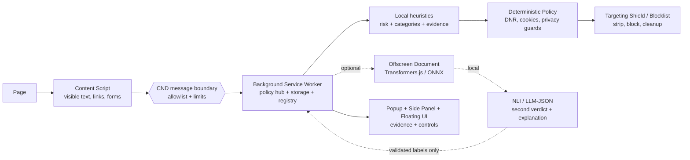

# PrivacyMyst — pakiet prezentacyjny PL

> **Kategoria:** Prywatność i Suwerenność Danych  
> **Rdzeń narracji:** Nie sprzedajemy magicznej anonimizacji. Sprzedajemy lokalny mikroskop prywatności, który pokazuje dowody i odpala konkretne, bezpieczne mechanizmy ochrony.

Ten dokument jest do mówienia na scenie. Deck jest w `presentation/src/story/deck.story.json`. To jest amunicja: skrypt, demo, role, Q&A, fallback.

---

## 1. Najkrótsza wersja — 20 sekund

PrivacyMyst to rozszerzenie przeglądarki, które działa jak **lokalny mikroskop prywatności**. Patrzy na bieżącą stronę, wykrywa sygnały profilowania — trackery, parametry reklamowe, formularze proszące o dane, fingerprinting, podejrzane linki i pliki — pokazuje użytkownikowi dowody, a ochronę odpala przez konkretne mechanizmy przeglądarki: DNR, czyszczenie parametrów, cookie hygiene, privacy guards i panic cleanup. AI, jeśli jest użyte, jest lokalnym drugim werdyktem i wyjaśnieniem, nie pilotem sterującym ochroną.

---

## 2. ELI5 — wyjaśnienie jak dla pięciolatka

Wyobraź sobie sklep, w którym każdy produkt ma małą karteczkę. Kiedy patrzysz na zabawkę, karteczka zapisuje: „lubi zabawki”. Kiedy patrzysz na lekarstwa, zapisuje: „może mieć problem zdrowotny”. Potem ktoś zbiera te karteczki i zgaduje, kim jesteś.

PrivacyMyst daje Ci latarkę i lupę:

1. **Lupa** pokazuje karteczki, których normalnie nie widzisz.
2. **Dowód** mówi, skąd wiemy, że coś jest ryzykowne.
3. **Tarcza** zdejmuje część karteczek albo blokuje najgorsze mechanizmy.
4. **AI** jest jak kolega, który pomaga wyjaśnić, dlaczego karteczka wygląda podejrzanie — ale nie biega sam po sklepie i niczego nie przestawia.

---

## 3. Czym to jest / czym to nie jest

### To jest

- **Lokalny mikroskop ryzyka** — analiza i dowody powstają po stronie przeglądarki.
- **Warstwa deterministycznej ochrony** — akcje robią reguły, blocklisty, storage/cookie cleanup, privacy guards.
- **UI kontroli** — popup, side panel, floating window, CyberRadar i Virtual Identity pokazują użytkownikowi stan ochrony.
- **Local-first AI explanation** — lokalna heurystyka jest baseline; opcjonalne lokalne NLI/LLM może potwierdzić i opisać dowody.

### To nie jest

- Nie jest pełną anonimizacją.
- Nie obiecuje, że użytkownik znika z internetu.
- Nie blokuje każdego trackera na świecie.
- Nie wysyła surowej historii przeglądania do modelu jako magicznej wyroczni.
- Nie pozwala LLM-owi zmieniać cookies, DNR, requestów ani DOM-u.

**Bezpieczna formuła do powtarzania:**  
> Local heuristic by default; optional local AI confirms/explains; protections are fixed browser-extension policy.

---

## 4. Architektura — wersja do pokazania jury

### Jedno zdanie techniczne

Content script zbiera ograniczony kontekst strony, background robi walidację i politykę, offscreen jest izolowanym miejscem dla opcjonalnej lokalnej inferencji, a UI dostaje tylko wynik i dowody — nie surową niekontrolowaną magię.

### Najważniejsza granica

> **AI is not the shield. AI is a local second verdict that explains why the shield was raised.**

Model:

- nie wykonuje akcji,
- nie zmienia reguł DNR,
- nie czyści cookies,
- nie steruje requestami,
- nie ufa własnemu JSON-owi bez walidacji,
- przy błędzie wypada z pipeline i zostaje heurystyka.

---

## 5. UI / persony / 3D / radar — jak o tym mówić uczciwie

### CyberRadar

**Co pokazać:** `src/components/CyberRadar.tsx` albo dashboard.  
**Jak mówić:** To jest wizualizacja realnych zdarzeń `HONEYPOT_ATTACK` i realnych impulsów DataGhost. Nie ma losowych fake kropek. Radar sam nie blokuje — pokazuje, co wykryła lub uruchomiła warstwa ochrony.

Zdanie sceniczne:
> Radar to nie teatr. Każda kropka ma pochodzić z realnego eventu, dlatego użytkownik widzi dowód, a nie animowaną bajkę.

### Virtual Identity Studio

**Co pokazać:** `src/components/VirtualIdentityStudio.tsx`.  
**Jak mówić:** To kreator profilu widzianego przez algorytmy śledzące. Użytkownik wybiera archetyp/personę albo custom, a system buduje spójny bucket: locale, timezone, platform, screen, CPU, RAM, WebGL vendor/renderer i tematy szumu.

Zdanie sceniczne:
> To nie jest generator niewidzialności. To kontroler spójności fingerprintu i edukacyjny panel pokazujący, jakie sygnały składają się na cyfrową personę.

### Bionic Blur presets

W kodzie są gotowe presety:

- `Gaming · Windows` — gracz PC z NVIDIA,
- `Biuro · Windows` — laptop biurowy Intel Iris Xe,
- `Kreatywny · macOS` — designer na MacBooku,
- `Developer · Linux` — programista z AMD.

Bezpieczne zdanie:
> Celem jest spójność sygnałów fingerprintu per origin, nie obietnica pełnej niewykrywalności.

### Babcia 3D / Three.js

**Co pokazać:** `src/components/StlModelViewer.tsx` + `assets/models/grandma.stl`.  
**Jak mówić:** Model STL jest ładowany leniwie, renderowany przez Three.js/WebGL, obraca się, respektuje `prefers-reduced-motion`. To efekt wow i element kreatora persony.

Zdanie sceniczne:
> Babcia 3D jest efektowna, ale nie udajemy, że to kryptografia. To UI, który pomaga ludziom zrozumieć personę i profil.

---

## 6. Demo flow — pięć ruchów bez paniki

1. **Otwórz stronę testową / popup.**  
   Powiedz: „Najpierw patrzymy lokalnie na sygnały ryzyka”.

2. **Pokaż Side Panel / Floating UI.**  
   Wskaż risk score, evidence tags, moduły ochrony.  
   Powiedz: „To jest dowód, nie aura bezpieczeństwa”.

3. **Pokaż konkretną tarczę.**  
   Link Guard, Data Footprint, Targeting Shield, Cookie Shredder albo DNR/blocklist.  
   Powiedz: „Ochrona dzieje się przez konkretne API przeglądarki i reguły”.

4. **Pokaż UI wow: Virtual Identity + Babcia 3D + CyberRadar.**  
   Powiedz: „To są interfejsy kontroli i dowodów, nie magia”.

5. **Zakończ Panic/Export albo podsumowaniem local-first.**  
   Powiedz: „Użytkownik ma widzieć, rozumieć i decydować”.

### Fallback line, gdy model nie działa

> Nawet jeśli lokalny model nie zdąży się załadować na tej maszynie, rdzeń ochrony nie pada, bo podstawą jest heurystyka i deterministyczna polityka. AI jest dodatkiem do wyjaśnienia, nie jedynym silnikiem ochrony.

---

## 7. Podział ról

### Hubert — teza + architektura + granice AI

**Opening:**  
> PrivacyMyst to nie obietnica niewidzialności. To lokalny mikroskop prywatności: wykrywa sygnały, pokazuje dowody i uruchamia konkretne tarcze.

**Masz powiedzieć:**
- Content script → background → validation → heuristics/policy → optional offscreen AI → UI.
- AI nie jest pilotem, tylko drugim werdyktem i tłumaczem.
- Jeżeli output modelu jest zły, walidacja go odrzuca i zostaje heurystyka.

**Nie mów:**
- „LLM chroni prywatność”.
- „AI odpala tarcze”.
- „Zero ryzyka, pełna anonimizacja”.

### Kacper — ELI5 + dane + bezpieczeństwo

**Opening:**  
> Śledzenie w internecie działa jak niewidzialne karteczki przyklejane do użytkownika. My je pokazujemy, opisujemy i zdejmujemy tam, gdzie możemy zrobić to bezpiecznie.

**Masz powiedzieć:**
- Suwerenność danych = użytkownik widzi koszt i kontroluje przełączniki.
- Dowody są ważniejsze niż vibe.
- Panic/export/storage to praktyczna kontrola, nie slogan.

### Bartek / Bartosz — UI + flow + backup

**Opening:**  
> Nasz interfejs ma jeden cel: zamienić abstrakcyjne profilowanie w coś, co użytkownik widzi i rozumie.

**Masz pokazać:**
- Popup/Side Panel.
- CyberRadar.
- Slajd demo flow.
- Backup, gdy live demo się wysypie.

### Krystian — persony + anty-tracking demo

**Opening:**  
> Same blokady to za mało, bo profilowanie składa się też z fingerprintu i zachowań. Dlatego mamy persony, Bionic Blur i warstwę wizualizacji zdarzeń.

**Masz pokazać:**
- Virtual Identity Studio.
- Bionic Blur presets.
- Babcia 3D.
- CyberRadar jako dowód eventów.

---

## 8. Pytania jury — odpowiedzi bez wciskania kitu

### Czy to anonimizuje użytkownika?

Nie. To ogranicza część sygnałów profilowania, pokazuje dowody i daje mechanizmy ochrony. Pełna anonimizacja w zwykłej przeglądarce byłaby nieuczciwą obietnicą.

### Czy AI decyduje o ochronie?

Nie. AI może klasyfikować i wyjaśniać dowody. Ochronę robi deterministyczna polityka: reguły DNR, cookie/storage cleanup, blocklisty i privacy guards.

### Czy wszystkie dane są offline?

Bezpieczna odpowiedź: analiza strony i domyślna ścieżka dowodowa są projektowane local-first. Nie sprzedajemy chmurowej analizy treści. Jeżeli jakaś funkcja wymaga zewnętrznego feedu albo usługi, musi być jawna, ograniczona i nie może być ukrytym endpointem inferencji.

### Czy blokujecie wszystkie trackery?

Nie. Blokujemy i neutralizujemy znane klasy sygnałów oraz hosty/listy, ale nie obiecujemy kompletności całego internetu. Projekt jest warstwowy: mniej ekspozycji, więcej kontroli, więcej dowodów.

### Czy persony są realną ochroną czy tylko zabawką?

Są warstwą kontroli fingerprintu i edukacji. Spójny profil może zmniejszyć chaotyczność sygnałów, ale nie gwarantuje niewykrywalności przeciwko każdemu anty-fraudowi.

### Czy CyberRadar coś blokuje?

Nie bezpośrednio. Radar wizualizuje eventy z innych modułów. Blokowanie i transformacje robią moduły ochrony, radar daje użytkownikowi czytelny obraz.

### Najsłabsza część?

Uczciwie: pełny fingerprint i anty-fraud to bardzo trudny problem. Dlatego nie mówimy „pełna anonimowość”. Nasza wartość to lokalna widoczność, dowody i konkretne tarcze dla najczęstszych sygnałów.

---

## 9. Pięć zdań zamykających

1. PrivacyMyst nie prosi użytkownika o ślepe zaufanie — pokazuje mu dowód.
2. AI nie jest tarczą; AI jest lokalnym tłumaczem dowodów.
3. Tarcze są deterministyczne: reguły, blocklisty, cookies, storage i privacy guards.
4. UI nie jest ozdobą — jest panelem kontroli nad własnym cieniem cyfrowym.
5. Suwerenność danych zaczyna się wtedy, gdy użytkownik widzi, co strona próbuje o nim zgadnąć.

---

## 10. Zdanie końcowe do wypowiedzenia wolno

> Nie chcemy, żeby użytkownik musiał wierzyć rozszerzeniu. Chcemy, żeby zobaczył dowód, zrozumiał ryzyko i sam zdecydował, jak mocną tarczę włącza.
